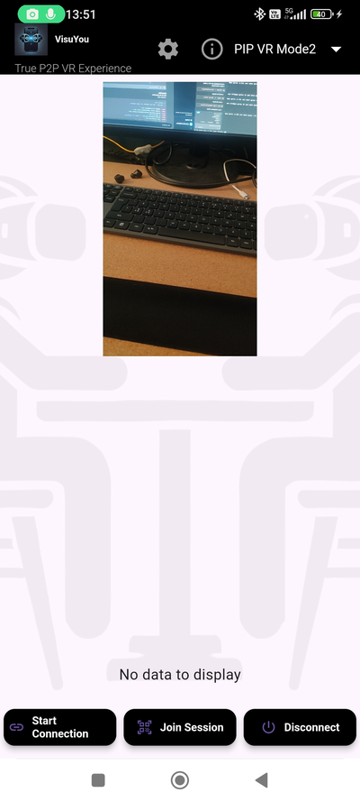

# VisuYou

## VisuYou - True P2P VR Experience

VisuYou is a peer-to-peer (P2P) virtual reality (VR) application developed using Flutter. It enables users to share and experience the world from another person's perspective in real time using VR headsets. Since the app establishes a direct connection between two devices without relying on any servers, your privacy and data remain secure.

### Screenshots

## Screenshots

### 1. Main Screen


### 2. Start Connection


### 3. Main Screen Connected


### 4. Mode 1 Full VR Mode


### 5. Mode 2 Full VR Mode2


### 6. Mode 3 50/50 VR Mode


### 7. Mode 4 PiP VR Mode


### 8. Mode 5 PiP VR Mode2


### 9. Settings Screen


## Features

### True P2P Connection
Connect directly with another device using WebRTC technology, ensuring a private and secure connection without intermediary servers.

### Multiple VR Modes
- **Full VR Mode**: Immersive experience with the same (remote) video feed in both eyes.  
- **Full VR Mode2**: Immersive experience with the local camera feed in both eyes.  
- **50/50 VR Mode**: Split-screen view, combining local and remote video streams side-by-side for each eye.  
- **PiP VR Mode**: Picture-in-Picture mode, displaying the remote stream within the local stream.  
- **PiP VR Mode2**: Picture-in-Picture mode, displaying the local stream within the remote stream.

### Voice Commands
Control and navigate the app using voice commands. Switch modes, enable or disable features, and more, all hands-free.

### QR Code Connection
Easily establish connections by generating or scanning QR codes. This provides a straightforward way to share connection offers between devices.

### Audio Support
Optionally enable or disable audio streaming in the settings.

### Cross-Platform Compatibility
Built with Flutter, VisuYou can run on multiple platforms that support Flutter, with a current focus on Android.

## Table of Contents
1. [Installation](#installation)  
2. [Prerequisites](#prerequisites)  
3. [Setup](#setup)  
4. [Build Instructions](#build-instructions)  
5. [Usage](#usage)  
   - [Establishing Connection](#establishing-connection)  
   - [Selecting VR Modes](#selecting-vr-modes)  
   - [Voice Commands](#voice-commands)  
   - [Settings](#settings)  
   - [Permissions](#permissions)  
6. [Troubleshooting](#troubleshooting)  
7. [Dependencies](#dependencies)  
8. [Contributing](#contributing)  
9. [License](#license)  
10. [Contact](#contact)  
11. [Getting Started](#getting-started)  
12. [Usage Scenarios](#usage-scenarios)  
13. [Considerations for Implementation](#considerations-for-implementation)  
14. [Additional Features to Enhance Use Cases](#additional-features-to-enhance-use-cases)

## Installation

### Prerequisites
- **Flutter SDK**: Make sure you have Flutter installed. Refer to the official Flutter installation guide.  
- **Android Device**: The current build targets Android.  
- **VR Headset**: Optional but highly recommended for a fully immersive experience.

## Setup

1. **Create a .env File**  
   Copy the file `assets/.env.example` to `assets/.env`.

2. **Add `VISUYOU_SECRET_KEY`**  
   In `assets/.env`, set the value of `VISUYOU_SECRET_KEY` to your own secret key. This is used for HMAC signature verification, providing secure connections.

## Build Instructions

### Clone the Repository

```bash
git clone https://github.com/yourusername/visuyou.git
cd visuyou
```

### Install Dependencies

```bash
flutter pub get
```

### Configure App Signing (For Release Builds)

Generate a keystore:

```bash
keytool -genkey -v -keystore ~/visuyou_keystore.jks -keyalg RSA -keysize 2048 -validity 10000 -alias your_alias
```

Create a file named `key.properties`:

```properties
storePassword=your_keystore_password
keyPassword=your_key_password
keyAlias=your_alias
storeFile=/path/to/visuyou_keystore.jks
```

Update `android/app/build.gradle`:

```groovy
def keystoreProperties = new Properties()
def keystorePropertiesFile = rootProject.file('key.properties')
if (keystorePropertiesFile.exists()) {
    keystoreProperties.load(new FileInputStream(keystorePropertiesFile))
}

android {
    // ...
    signingConfigs {
        release {
            keyAlias keystoreProperties['keyAlias']
            keyPassword keystoreProperties['keyPassword']
            storeFile keystoreProperties['storeFile'] ? file(keystoreProperties['storeFile']) : null
            storePassword keystoreProperties['storePassword']
        }
    }
    buildTypes {
        release {
            signingConfig signingConfigs.release
            minifyEnabled false
            // ...
        }
    }
}
```

### Build the App

```bash
flutter build apk --debug
flutter build apk --release
flutter build appbundle --release
```

### Install the App on Your Device

```bash
flutter install
```

## Usage

### Establishing Connection
1. **Launch the App** on both devices.  
2. **Start Connection** on the first device:  
   Tap "Start Connection" to generate a QR code containing the offer.  
3. **Join Session** on the second device:  
   Tap "Join Session" and scan the QR code shown on the first device.  
4. **Complete the Connection**:  
   On the first device, tap "Join Session" again to scan the QR code displayed on the second device (creating a complete P2P handshake).

### Selecting VR Modes
Use the dropdown menu in the app bar to switch modes:
- **Full VR Mode**: Remote camera feed in both eyes.  
- **Full VR Mode2**: Local camera feed in both eyes.  
- **50/50 VR Mode**: Split-screen of both local and remote feeds for each eye.  
- **PiP VR Mode**: The remote stream overlaid within the local stream.  
- **PiP VR Mode2**: The local stream overlaid within the remote stream.

### Voice Commands
Enable voice commands in Settings to use keywords:

#### Navigation
- "Next", "Forward", or "Left" cycles through VR modes forward.  
- "Back", "Previous", or "Right" cycles backward.

#### Audio
- "mic on" or "enable mic" / "mic off" or "disable mic"  
- "speaker on" or "enable speaker" / "speaker off" or "disable speaker"

#### VR Modes
- "mode one" or "screen one" (Full VR Mode)  
- "mode two" or "screen two" (Full VR Mode2)  
- "mode three" or "screen three" (50/50 VR Mode)  
- "mode four" or "screen four" (PiP VR Mode)  
- "mode five" or "screen five" (PiP VR Mode2)

### Settings
- **Eye Separation**: Adjust separation for VR modes.  
- **Enable Mic**: Toggle microphone streaming.  
- **Enable Speaker**: Toggle speaker audio.  
- **Enable Voice Commands**: Turn on/off voice recognition.  
- **Voice Commands Configuration**: Customize or disable individual commands.  
- **Privacy Policy & Terms of Service**: Review from within the app.

### Permissions
Make sure to grant:
- **Camera** (for streaming video)  
- **Microphone** (for streaming audio if enabled)  
- **Network State / Internet** (for WebRTC connections)  
- **Bluetooth** (needed for certain network states on Android)  
- **Audio Settings** (to adjust volumes and speaker states)

## Troubleshooting

- **Connection Issues**: Verify both devices have a stable network and the necessary permissions.  
- **Camera Not Found**: The app defaults to back camera when available; otherwise, it uses any available camera.  
- **Voice Commands Not Working**: Check mic permissions and confirm that voice commands are enabled in Settings.  
- **App Crashes/Freezes**: Restart the app, clear cache, or update dependencies.

## Dependencies
VisuYou relies on multiple Flutter packages, including (but not limited to):
- flutter_webrtc  
- permission_handler  
- qr_flutter  
- flutter_barcode_scanner  
- vosk_flutter  
- shared_preferences  
- archive  
- camera  
- vibration  
- crypto  
- flutter_dotenv  

For a complete list, see `pubspec.yaml`.

## Contributing
Contributions are welcome!

1. **Fork the Repository**: Click "Fork" on GitHub.  
2. **Create a Feature Branch**:

```bash
git checkout -b feature/YourFeature
```

3. **Commit Your Changes**:

```bash
git commit -am 'Add new feature'
```

4. **Push to the Branch**:

```bash
git push origin feature/YourFeature
```

5. **Open a Pull Request** on GitHub.

## License
This project is licensed under [Your License Name]. You may add more details or a link to your license file here.

## Contact
For questions or support:
- **Email**: sami.hekkanen@gmail.com  
- **GitHub**: shekkanen

## Getting Started
This project is a starting point for a Flutter application. If this is your first Flutter project, you may want to review:
- **Flutter Dev’s Getting Started**  
- **Lab: Write your first Flutter app**  
- **Cookbook: Useful Flutter samples**

## Usage Scenarios
VisuYou can facilitate a wide range of real-time, immersive experiences, including:
- Shared Experiences for Couples  
- Virtual Tourism and Exploration  
- Education and Training  
- Remote Assistance and Support  
- Medical and Healthcare Applications  
- Emergency Services and Safety  
- Sports and Training  
- Entertainment and Gaming  
- Artistic Collaboration  
- Accessibility Enhancements  
- Research and Field Studies  
- Family Connections  
- Journalism and Reporting  
- Psychological Therapy and Counseling  
- Mindfulness and Empathy Exercises

## Considerations for Implementation
- **Privacy and Consent**: Users must be fully informed about the nature of streaming and sharing perspectives.  
- **Security**: P2P connections must be encrypted.  
- **User Experience**: Streamlined controls and user-friendly VR navigation are crucial.  
- **Compliance**: Be aware of regional laws and regulations around data handling and user privacy.

## Additional Features to Enhance Use Cases
- **Gesture Recognition**: For hands-free interactions.  
- **Customization Options**: Toggle video quality, switch front/back camera, etc.  
- **Session Recording**: Optionally allow session recording (with mutual consent) for later review.

Enjoy exploring the world from another person’s perspective, all while maintaining the highest standard of privacy and security!